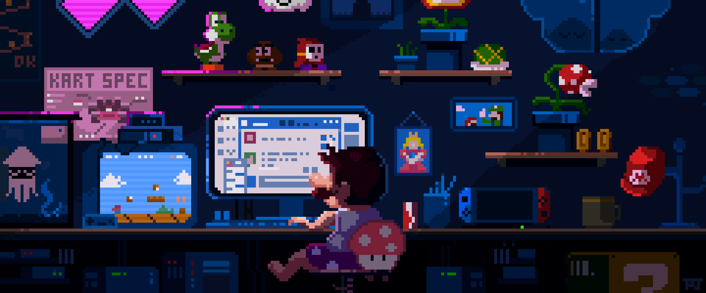

  

<h1>Hi 👋, I'm Rakib</h1>

  

<table align="center">
<tr border="none">
<td width="50%" align="left">
  
- 🔭 I'm currently working on **[SOHOJOGI](https://github.com/Learnathon-By-Geeky-Solutions/team-synergy)**

- 🌱 I'm currently learning **App Development**

- 💬 Ask me about **C++, Python, Java**

- 📫 How to reach me **rakibhasan4101@gmail.com**

- 📄 Check out my [CV](resources/Md.%20Rakib%20Hasan.pdf) and [Portfolio](https://afnanrakib.github.io/AfnanRakib/)

- ⚡ Fun fact **I think I am passionate about programming**

</td>
<td width="50%" align="center">

  

  </td>
</tr>
</table>

<!-- Stats -->

  <h2>📊 GitHub Analytics | My Coding Journey in Numbers</h2>
    
  
    

<!-- Trophies -->

  <h2>🏆 GitHub Achievements</h2>
  

<!-- Tech Stack -->

## 💻 Tech Stack

## 🌐 Connect with Me 

